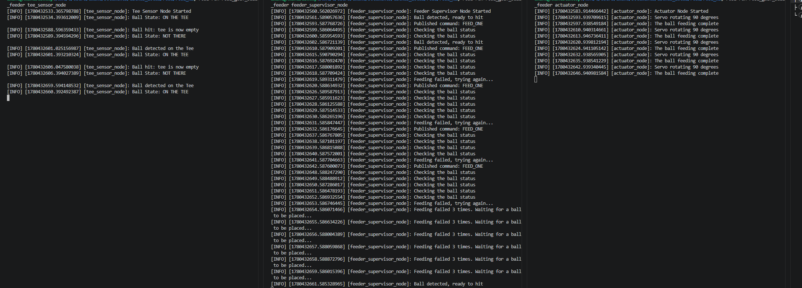

# ROS2 Automated Golf Ball Tee Feeder

## 📌 Overview
This project explores the design and implementation of an automated golf ball tee feeder, beginning with a ROS2-based software architecture and evolving into a physical ESP32-controlled prototype.
The system follows a complete robotics pipeline:
**Sense → Decide → Act → Verify**

## Current Project Status
This project began as a ROS2-based simulation used to develop and validate the sensing, supervisory, and actuation architecture of an automated golf ball feeder.

The project has since evolved into a physical prototype consisting of:
   - ESP32 microcontroller
   - Microswitch-based tee sensor
   - Servo-actuated feeder mechanism
   - Mechanical golf ball hopper

The current hardware prototype uses a tee-mounted microswitch to detect when a golf ball is removed from the tee, dispenses a replacement ball, verifies successful placement using sensor feedback, retries failed feed attempts up to three times, and enters a fault state requiring manual intervention if recovery is unsuccessful.

The physical prototype implements the same feed, verification, retry, and fault-recovery logic originally developed in the ROS2 simulation.

## 🎯 Key Features
- ROS2 multi-node architecture
- Event-driven ROS2 execution using publishers, subscribers, timers, and callbacks
- Closed-loop feedback using actuator status and sensor verification
- Retry logic with failure handling
- Launch-based execution for full system orchestration

## Engineering Motivation
This project was built to practice ROS2 system architecture by implementing a complete sensing, supervisory, and actuation pipeline. Although inspired by an automated golf tee feeder, the architecture mirrors common robotics patterns used in industrial automation and autonomous systems.

Many robotics systems must continuously monitor the environment, make decisions based on sensor input, and verify that actions were successfully executed.

## Project Evolution
- Phase 1: ROS2 Architecture Prototype (Completed)
   - Multi-node ROS2 architecture
   - Supervisor state machine
   - Publisher/subscriber communication
   - Verification and retry logic
   - Launch-based orchestration
   ```text
   tee_sensor_node
      ↓
   feeder_supervisor_node
      ↓
   actuator_node
   ```

- Phase 2: Embedded Hardware Prototype (Current)
   - ESP32 embedded controller
   - Microswitch tee sensor
   - Servo-based dispensing mechanism
   - Autonomous ball detection
   - Verification and fault recovery
   ```text
   Microswitch
      ↓
   ESP32
      ↓
   Servo
      ↓
   Golf Ball
   ```

- Phase 3: ROS2 ↔ ESP32 Integration (Planned)
   - Serial communication between ROS2 and ESP32
   - High-level ROS2 supervision
   - Low-level embedded sensing and actuation
   - System monitoring and diagnostics
   ```text
   ROS2 Supervisor
      ↓ Serial
   ESP32 Controller
      ↓
   Sensor + Servo
   ```

## 🧠 System Architecture
## State Machine
1. **Idle State**
   - Ball is present on the tee
 ↓
2. **Detection**
   - If ball is missing for 3 seconds → trigger feed
 ↓
3. **Actuation**
   - Actuator simulates servo rotation (90°)
   - Publishes `"DONE"` after completion
 ↓
4. **Verification**
   - Supervisor waits for sensor confirmation
   - If ball not detected → retry (max 3 attempts)
 ↓
5. **Failure Handling**
   - After 3 failed attempts → system waits for manual intervention

### Nodes
|           Node           |                   Responsibility                    |
|--------------------------|-----------------------------------------------------|
| `tee_sensor_node`        | Publishes whether a ball is present on the tee      |
| `feeder_supervisor_node` | State machine that decides when to feed             |
| `actuator_node`          | Simulates servo-based feeder and reports completion |

```text
   tee_sensor_node
         │
         │ ball_present
         ▼
   feeder_supervisor_node
         │
         │ FEED_ONE
         ▼
   actuator_node
         │
         │ DONE
         └───────────────► feeder_supervisor_node
```

### Topics
|         Topic       |   Type   |              Description             |
|---------------------|----------|--------------------------------------|
| `/tee/ball_present` | `Bool`   | Sensor state (ball present or not)   |
| `/feeder/command`   | `String` | Command to actuator (`FEED_ONE`)     |
| `/feeder/status`    | `String` | Actuator feedback (`DONE`)           |
| `/sim/toggle_ball`  | `Empty`  | Simulation trigger for ball state    |

## 🚀 Running the System
### 1. Build
```bash
colcon build --symlink-install
source install/setup.bash
```

### 2. Launch
```bash
ros2 launch ros2_golf_ball_feeder feeder_system.launch.py
```

### 3. Simulate Ball Events
To simulate the ball presence, the below is necessary to toggle whether the ball is on the tee.
When system is launched in a terminal, open another terminal and run:
```bash
ros2 topic pub --once /sim/toggle_ball std_msgs/msg/Empty "{}"
```
each time the ball presence state needs to be changed. (First call -> ball removed, second call -> ball placed)

## Demo
The video below demonstrates the physical function of the system.

[Video Demonstration](videos/golf_ball_feeder_demo.MOV)

The example below demonstrates a complete cycle in the ROS2 system:
ball removed → supervisor detects absence → feed command issued → actuator responds → supervisor verifies ball placement.

- Left: tee_sensor_node
- Center: feeder_supervisor_node
- Right: actuator_node



## 🛠 Technologies Used
### Software
- ROS2 (rclpy)
- Python
- State-machine architecture
- Publisher/Subscriber communication

### Embedded
- ESP32
- Embedded C++
- ESP32Servo Library
- Microswitch sensing

## 💡 Key Takeaways
- Designed a modular ROS2 system with clear separation of concerns
- Implemented closed-loop control using feedback and verification
- Built a realistic failure-handling and retry mechanism

## Project Outcome
- Successfully designed a ROS2-based automation architecture and implemented a corresponding physical ESP32-controlled prototype.
- Demonstrated sensing, decision-making, actuation, verification, retry logic, and fault recovery in both simulated and physical environments.
- The project demonstrates a complete Sense → Decide → Act → Verify pipeline commonly used in robotics and industrial automation systems.

## Lessons Learned
- Designing state-machine logic is critical for reliable robotic behavior.
- Feedback verification is more robust than assuming actuator commands always succeed.
- ROS2 timers and callbacks enable responsive non-blocking system execution.
- Modular node separation improves maintainability and testing.

## 📈 Future Improvements
- Integrate ROS2 and ESP32 through serial communication
- Replace String messages with custom ROS2 message types
- Add system diagnostics and logging
- Improve feeder reliability through repeated testing
- Add visualization (RViz or state topic)