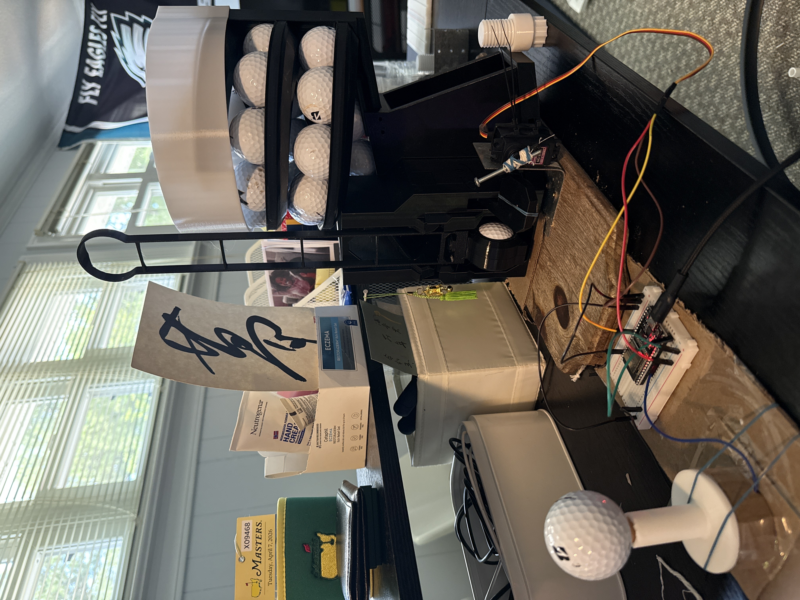
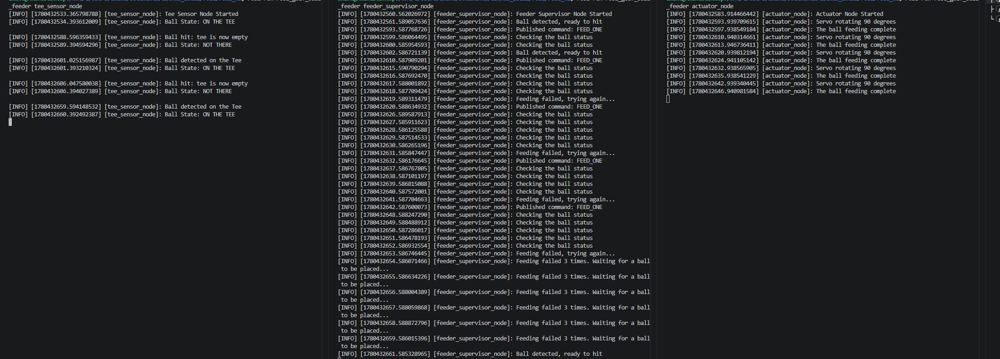

# ROS2 Automated Golf Ball Tee Feeder

## 📌 Overview
This project explores the design and implementation of an automated golf ball tee feeder, beginning with a ROS2-based software architecture and evolving into a physical ESP32-controlled prototype.
The system follows a complete robotics pipeline:
**Sense → Decide → Act → Verify**

## Current Project Status
The project currently consists of a ROS2-based supervisory architecture integrated with a physical ESP32-controlled golf ball feeder prototype.

The system uses:
- ROS2 for supervisory control and decision making
- ESP32 firmware for low-level sensing and actuation
- Serial communication between ROS2 and ESP32
- A microswitch-based tee sensor
- A servo-actuated feeding mechanism

When a ball is removed from the tee, the ESP32 detects the event and reports the tee state to ROS2 through a serial bridge node. The ROS2 supervisor determines when a feed operation should occur and sends a feed command back to the ESP32, which actuates the servo and dispenses a replacement ball.

The system demonstrates a complete physical Sense → Decide → Act → Verify pipeline using ROS2 and embedded hardware.

## 🎯 Key Features
- ROS2 multi-node architecture
- Event-driven ROS2 execution using publishers, subscribers, timers, and callbacks
- Closed-loop feedback using actuator status and sensor verification
- Retry logic with failure handling
- Launch-based execution for full system orchestration

## Engineering Motivation
This project was built to practice ROS2 system architecture by implementing a complete sensing, supervisory, and actuation pipeline. Although inspired by an automated golf tee feeder, the architecture mirrors common robotics patterns used in industrial automation and autonomous systems.

Many robotics systems must continuously monitor the environment, make decisions based on sensor input, and verify that actions were successfully executed.

## Project Evolution
- Phase 1: ROS2 Architecture Prototype (Completed)
   - Multi-node ROS2 architecture
   - Supervisor state machine
   - Publisher/subscriber communication
   - Verification and retry logic
   - Launch-based orchestration
   ```text
   tee_sensor_node
      ↓
   feeder_supervisor_node
      ↓
   actuator_node
   ```

- Phase 2: Embedded Hardware Prototype (Completed)
   - ESP32 embedded controller
   - Microswitch tee sensor
   - Servo-based dispensing mechanism
   - Autonomous ball detection
   - Verification and fault recovery
   ```text
   Microswitch
      ↓
   ESP32
      ↓
   Servo
      ↓
   Golf Ball
   ```

- Phase 3: ROS2 ↔ ESP32 Integration (Completed)
   - Serial communication between ROS2 and ESP32
   - ROS2 serial bridge node
   - Physical tee sensor feedback into ROS2
   - ROS2 command transmission to embedded hardware
   - Hardware-in-the-loop operation
   ```text
  Microswitch
      ↓
   ESP32 Firmware
      ↓ BALL_PRESENT / BALL_MISSING
   serial_bridge_node
      ↓
   feeder_supervisor_node
      ↓ FEED_ONE
   serial_bridge_node
      ↓
   ESP32 Firmware
      ↓
   Servo Actuator
   ```

## 🧠 System Architecture
## State Machine
1. **Idle State**
   - Ball is present on the tee
 ↓
2. **Detection**
   - If ball is missing for 3 seconds → trigger feed
 ↓
3. **Actuation**
   - Actuator simulates servo rotation (90°)
   - Publishes `"DONE"` after completion
 ↓
4. **Verification**
   - Supervisor waits for sensor confirmation
   - If ball not detected → retry (max 3 attempts)
 ↓
5. **Failure Handling**
   - After 3 failed attempts → system waits for manual intervention

### Nodes
|           Node           |                   Responsibility                    |
|--------------------------|-----------------------------------------------------|
| `tee_sensor_node`        | Publishes whether a ball is present on the tee      |
| `feeder_supervisor_node` | State machine that decides when to feed             |
| `actuator_node`          | Simulates servo-based feeder and reports completion |
| `serial_bridge_node`     | Bridges ROS2 topics and ESP32 serial communication  |

```text
Microswitch
     │
     ▼
ESP32 Firmware
     │ BALL_PRESENT / BALL_MISSING
     ▼
serial_bridge_node
     │
     ▼
feeder_supervisor_node
     │ FEED_ONE
     ▼
serial_bridge_node
     │
     ▼
ESP32 Firmware
     │
     ▼
Servo Actuator
```

### Topics
|         Topic       |   Type   |              Description             |
|---------------------|----------|--------------------------------------|
| `/tee/ball_present` | `Bool`   | Sensor state (ball present or not)   |
| `/feeder/command`   | `String` | Command to actuator (`FEED_ONE`)     |
| `/sim/toggle_ball`  | `Empty`  | Simulation trigger for ball state    |

## 🚀 Running the System
### 1. Build
```bash
colcon build --symlink-install
source install/setup.bash
```

### 2. Launch
```bash
ros2 launch ros2_golf_ball_feeder feeder_system.launch.py
```

### 3.1 Simulation Mode
Run:
- tee_sensor_node
- feeder_supervisor_node
- actuator_node

Toggle ball state using:

ros2 topic pub --once /sim/toggle_ball std_msgs/msg/Empty "{}"

### 3.2 Hardware Mode
Run:
- serial_bridge_node
- feeder_supervisor_node

Connect ESP32 via USB and remove the ball physically from the tee to trigger a feed cycle.

## Demo
The video below demonstrates the physical function of the system.

[Video Demonstration](videos/golf_ball_feeder_demo.mp4)

The example below demonstrates a complete cycle in the ROS2 system:
ball removed → supervisor detects absence → feed command issued → actuator responds → supervisor verifies ball placement.

- Left: tee_sensor_node
- Center: feeder_supervisor_node
- Right: actuator_node



## 🛠 Technologies Used
### Software
- ROS2 (rclpy)
- Python
- State-machine architecture
- Publisher/Subscriber communication

### Embedded
- ESP32
- Embedded C++
- ESP32Servo Library
- Microswitch sensing

### Communication
- USB Serial Communication
- PySerial

## 💡 Key Takeaways
- Designed a modular ROS2 system with clear separation of concerns
- Implemented closed-loop control using feedback and verification
- Built a realistic failure-handling and retry mechanism

## Project Outcome
Successfully integrated a ROS2 supervisory architecture with a physical ESP32-controlled golf ball feeder prototype.

The final system demonstrates:
- Embedded sensing and actuation
- ROS2 node-based supervision
- Serial communication between ROS2 and embedded hardware
- Closed-loop verification and retry logic
- Hardware-in-the-loop operation

## Lessons Learned
- Designing state-machine logic is critical for reliable robotic behavior.
- Feedback verification is more robust than assuming actuator commands always succeed.
- ROS2 timers and callbacks enable responsive non-blocking system execution.
- Modular node separation improves maintainability and testing.

## 📈 Future Improvements
- Publish ESP32 feed completion ("DONE") as a ROS2 status topic
- Replace String commands with custom ROS2 message types
- Add diagnostics and health monitoring
- Improve feeder reliability through repeated testing
- Add RViz visualization or dashboard monitoring